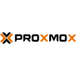

<h1 align="center">Hi, I'm Jack Sweeney</h1>
<h3 align="center">I create open source aviation tracking systems, alerts, and data platforms.</h3>

I'm best known for creating **ElonJet** and other high profile aircraft tracking platforms using public ADS-B data. I started with [**plane-notify**](https://github.com/Jxck-S/plane-notify) to open up aviation transparency and have since evolved my work into a global ecosystem of real time data and alerting tools.

---

### Featured Projects

<table border="0">
  <tr>
    <td width="50%" align="center">
      
    </td>
    <td width="50%" align="center">
      
    </td>
  </tr>
</table>

 

---

- Currently maintaining and growing **TheAirTraffic** and **Ground Control** while supporting [**plane-notify**](https://github.com/Jxck-S/plane-notify) as a smaller scope explanatory tool
- Open to collaborators interested in aviation data, ADS-B, or open source systems
- Reach me at: **JackHSweeney@protonmail.com**

### Languages

<table>
  <tr>
    <td align="center" width="100">
      <a href="https://www.python.org">
         Python
      </a>
    </td>
    <td align="center" width="100">
      <a href="https://developer.mozilla.org/en-US/docs/Web/JavaScript">
         JavaScript
      </a>
    </td>
    <td align="center" width="100">
      <a href="https://www.typescriptlang.org/">
         TypeScript
      </a>
    </td>
    <td align="center" width="100">
      <a href="https://php.net">
         PHP
      </a>
    </td>
    <td align="center" width="100">
      <a href="https://en.wikipedia.org/wiki/C_(programming_language)">
         C
      </a>
    </td>
    <td align="center" width="100">
      <a href="https://www.java.com/">
         Java
      </a>
    </td>
  </tr>
</table>

### Web & Frameworks

<table>
  <tr>
    <td align="center" width="100">
      <a href="https://nextjs.org/">
         Next.js
      </a>
    </td>
    <td align="center" width="100">
      <a href="https://fastapi.tiangolo.com/">
         FastAPI
      </a>
    </td>
    <td align="center" width="100">
      <a href="https://flask.palletsprojects.com/">
         Flask
      </a>
    </td>
    <td align="center" width="100">
      <a href="https://angular.io/">
         Angular
      </a>
    </td>
    <td align="center" width="100">
      <a href="https://nodejs.org/">
         Node.js
      </a>
    </td>
  </tr>
</table>

### Testing & Automation

<table>
  <tr>
    <td align="center" width="100">
      <a href="https://jestjs.io/">
         Jest
      </a>
    </td>
    <td align="center" width="100">
      <a href="https://www.selenium.dev/">
         Selenium
      </a>
    </td>
  </tr>
</table>

### Tools & DevOps

<table>
  <tr>
    <td align="center" width="100">
      <a href="https://git-scm.com/">
         Git
      </a>
    </td>
    <td align="center" width="100">
      <a href="https://www.linux.org/">
         Linux
      </a>
    </td>
    <td align="center" width="100">
      <a href="https://www.docker.com/">
         Docker
      </a>
    </td>
  </tr>
  <tr>
    <td align="center" width="100">
      <a href="https://kubernetes.io/">
         Kubernetes
      </a>
    </td>
    <td align="center" width="100">
      <a href="https://www.ansible.com/">
         Ansible
      </a>
    </td>
    <td align="center" width="100">
      <a href="https://www.zabbix.com/">
         Zabbix
      </a>
    </td>
  </tr>
</table>

### Databases

<table>
  <tr>
    <td align="center" width="100">
      <a href="https://www.postgresql.org/">
         PostgreSQL
      </a>
    </td>
    <td align="center" width="100">
      <a href="https://www.mysql.com/">
         MySQL
      </a>
    </td>
    <td align="center" width="100">
      <a href="https://mariadb.org/">
         MariaDB
      </a>
    </td>
  </tr>
</table>

### Infrastructure & Proxy

<table>
  <tr>
    <td align="center" width="100">
      <a href="https://www.proxmox.com/">
         Proxmox
      </a>
    </td>
    <td align="center" width="100">
      <a href="https://www.haproxy.org/">
         HAProxy
      </a>
    </td>
    <td align="center" width="100">
      <a href="https://www.nginx.com/">
         Nginx
      </a>
    </td>
  </tr>
</table>

---

### Skills & Experience

-  Python, JavaScript, TypeScript, Java, C, PHP, HTML, CSS, SQL  
-  Next.js, FastAPI, Flask, Django, BeautifulSoup, Angular, Node.js  
-  Git, Docker, Kubernetes, Ansible, Zabbix, Postman, Curl, Jest, Selenium, Cypress, Figma  
-  Linux, VMware vSphere, Proxmox, HAProxy, Nginx, REST APIs, WebSockets  
-  TCP/IP, DNS, DHCP, VLANs, NAT, LACP, VPN, SSH  
-  PostgreSQL, MariaDB, MySQL  
-  Agile, UML, Jira, Rally  
-  Regex, Test Automation, Technical Writing, System Monitoring, Zabbix

---

